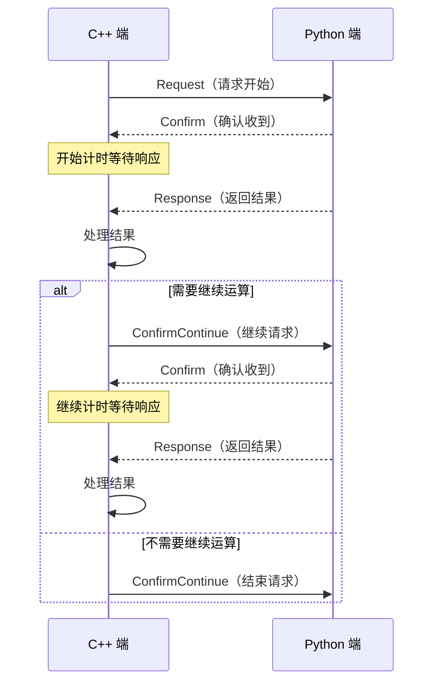

# 📘 RRCC 通信协议规范

**Author**：Gsh  
**Version**: 0.0
**Date**：2025/5/16  

---

### 1. 协议简介

**RRCC 协议**（Request–Response–Confirm-ConfirmContinue）是一个自定义的，轻量级的、基于 Protobuf 的应用层通信协议，设计用于 C++ 与 Python 进程之间的结构化消息传递。协议强调 **明确的控制流** 与 **响应机制**，由 C++ 端主导通信过程，Python 端作为计算响应方。

---

### 2. 协议目的

	•	实现 C++ 与 Python 之间的高效数据交互
	•	保证通信顺序与状态一致性
	•	提高系统健壮性，避免空转与计算资源浪费
	•	保持通信接口的清晰与可扩展性

---

### 3. 消息定义（Protobuf）

定义文件位于 share/proto/py_msg.proto，包括以下消息类型：

| 消息类型          | 描述                         |
|------------------|-----------------------------|
| `Request`        | 请求开始，携带参数             |
| `Confirm`        | 确认收到请求                  |
| `Response`       | 返回处理结果                  |
| `ConfirmContinue`| 表示是否继续请求或终止通信       |

---

### 4. 协议流程

---

### 5. 状态说明

| 阶段                | 发起方  | 接收方   | 动作说明                           |
|--------------------|--------|--------|------------------------------------|
| 初始化请求           | C++    | Python | 发送 Request                        |
| 确认收到请求         | Python | C++    | 回复 Confirm                        |
| 执行计算 & 返回结果  | Python | C++    | 回复 Response                        |
| 决定继续 or 终止        | C++    | Python | 发送 ConfirmContinue  or 停止发送消息  |

---

### 6. 异常处理机制

| 场景          | Python 端行为            | C++ 端行为    |
|----------|-----------|----------------|
| 启动后 C++ 端无请求  | Python 维持空闲状态，不主动退出  | -     |
| C++ 崩溃或调试中断   | Python 维持空闲状态，不主动退出    | -       |
| Python 独立计算线程异常 | 在下次收到重传后重启线程  | C++ 捕捉不到响应，触发超时重传   |
| Python 主线程崩溃   | -    | C++ 捕捉不到响应，触发超时重传   |
| 未按约定顺序发送消息   | 对未收到对应 `RequestMsg` 的 `ConfirmContinueMsg` 不响应  | 未定义行为，可能导致崩溃   |

---

### 7. 协议优势

- **主从明确**：C++ 端控制节奏，Python 端专注计算
- **结构灵活**：比传统的gRPC可拓展性更高，便于实现被动端挂起
- **解耦性强**：协议层解耦业务逻辑，便于扩展
- **高效无阻塞**：非请求时不占用 Python 端资源
- 支持长连接、**多轮通信**

---

### 8. 示例

参考[PyModule_服务器调用原理，两类服务器差异](./PyModule_服务器调用原理，两类服务器差异.md)

