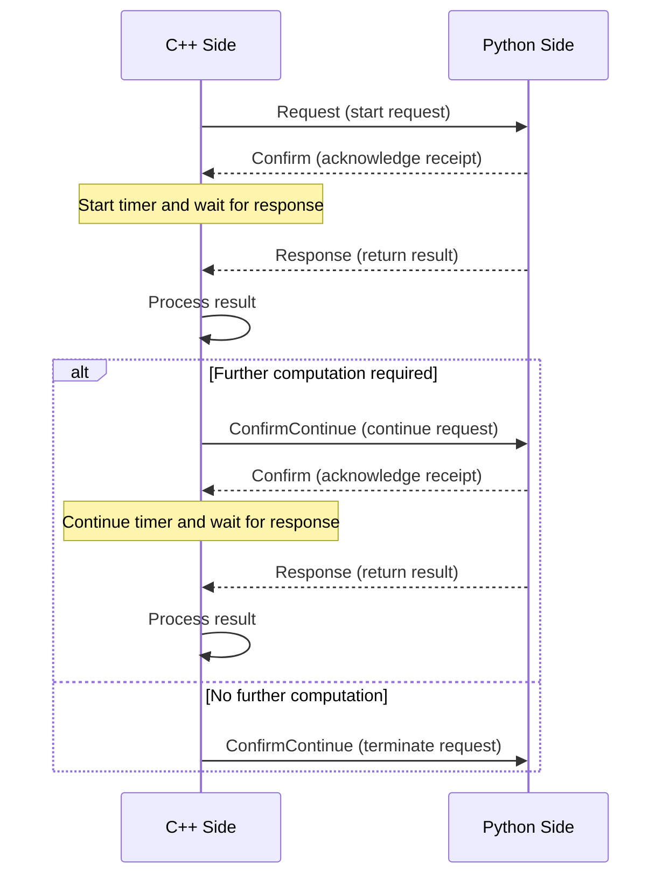

# RRCC Communication Protocol Specification

**Author**: Gsh  
**Version**: 0.0  
**Date**: 2025/5/16  

---

### 1. Protocol Overview

The **RRCC Protocol** (Request–Response–Confirm–ConfirmContinue) is a custom lightweight application-layer communication protocol based on Protobuf.  
It is designed for structured message exchange between C++ and Python processes.  
The protocol emphasizes **clear control flow** and **response mechanisms**, with the C++ side leading the communication while the Python side acts as the computation responder.

---

### 2. Protocol Objectives

- Enable efficient data exchange between C++ and Python  
- Ensure communication order and state consistency  
- Improve system robustness, avoiding idle loops and wasted resources  
- Maintain clear and extensible communication interfaces  

---

### 3. Message Definitions (Protobuf)

The definition file is located in `share/proto/py_msg.proto`, which includes the following message types:

| Message Type       | Description                              |
|--------------------|------------------------------------------|
| `Request`          | Initiates a request with parameters      |
| `Confirm`          | Acknowledges receipt of the request      |
| `Response`         | Returns the processing result            |
| `ConfirmContinue`  | Indicates whether to continue or stop     |

---

### 4. Protocol Flow

---

### 5. State Description

| Stage                  | Initiator | Receiver | Action Description                              |
|-------------------------|-----------|----------|------------------------------------------------|
| Initialize Request      | C++       | Python   | Send `Request`                                  |
| Confirm Receipt         | Python    | C++      | Reply with `Confirm`                            |
| Execute & Return Result | Python    | C++      | Reply with `Response`                           |
| Decide Continue/Stop    | C++       | Python   | Send `ConfirmContinue` or stop sending messages |

---

### 6. Exception Handling Mechanism

| Scenario                        | Python Side Behavior                                | C++ Side Behavior                                |
|---------------------------------|----------------------------------------------------|--------------------------------------------------|
| C++ sends no request after start | Python remains idle, does not exit proactively     | -                                                |
| C++ crashes or debugging stops   | Python remains idle, does not exit proactively     | -                                                |
| Python worker thread crashes     | Restart thread upon receiving retransmission       | C++ detects no response, triggers timeout & retransmission |
| Python main thread crashes       | -                                                  | C++ detects no response, triggers timeout & retransmission |
| Message order violated           | Ignore `ConfirmContinueMsg` without corresponding `RequestMsg` | Undefined behavior, may cause crash |

---

### 7. Advantages of the Protocol

- **Clear master-slave relationship**: C++ controls the flow, Python focuses on computation  
- **Flexible structure**: More extensible than traditional gRPC, easier to suspend passive side  
- **Strong decoupling**: Protocol layer decouples from business logic, easy to extend  
- **Efficient & non-blocking**: Python consumes no resources when no request is pending  
- Supports persistent connections and **multi-round communication**  
